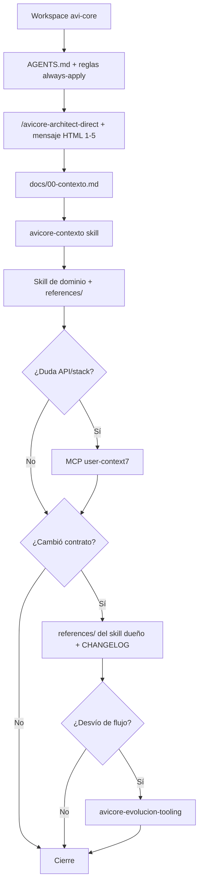

# Configuración de Cursor para AviCore

[Rules](https://cursor.com/docs/rules) · [Skills](https://cursor.com/docs/skills)

## Flujo del agente



**Usuario:** `/avicore-architect-direct` + plantillas HTML. **Skills de dominio:** auto-invoke por descripción. **Skills internos** (auditoría, PR, evolución): `disable-model-invocation: true`.

## Punto de entrada

| Prioridad | Archivo |
|-----------|---------|
| 1 | [`docs/00-contexto.md`](../docs/00-contexto.md) |
| 2 | [`.cursor/commands/avicore-architect-direct.md`](commands/avicore-architect-direct.md) |
| 3 | [`.cursor/skills/README.md`](skills/README.md) |
| 4 | [`AGENTS.md`](../AGENTS.md) |

## Inventario

| Capa | Ubicación |
|------|-----------|
| Docs humanos mínimos | `docs/00-contexto.md`, `CHANGELOG.md`, `cursor/02.html` |
| Skills (15) | `.cursor/skills/*/SKILL.md` |
| Referencias de producto | `.cursor/skills/*/references/*.md` |
| Reglas | `.cursor/rules/*.mdc` |
| Comando slash | `.cursor/commands/avicore-architect-direct.md` |

## Reglas `.cursor/rules/`

| Regla | Cuándo |
|-------|--------|
| `avicore-agente-permanente.mdc` | Siempre |
| `avicore-modo-respuesta-clara.mdc` | Siempre |
| `avicore-modo-caverman.mdc` | Opcional |
| `avicore-laravel-livewire.mdc` | `*.php`, `*.blade.php` |
| `avicore-ui-tailwind.mdc` | views, css, js |
| `avicore-ui-motion.mdc` | views, css (motion, blur, scale) |
| `avicore-estandares-codigo.mdc` | app, resources, tests |
| `avicore-docs-referencia.mdc` | skill references de BD/proyecto |

## MCP

| Servidor | Uso |
|----------|-----|
| `user-context7` | Dudas de API/stack (máx. 3 consultas por tarea) |
| `user-github` | Mensaje 5 / PR |

## Anti-drift

```bash
node scripts/check-agent-docs-sync.cjs
node scripts/check-skill-references.cjs
pnpm run check:agent-docs
```

Gobernanza: [`skills/avicore-evolucion-tooling/references/GOBERNANZA.md`](skills/avicore-evolucion-tooling/references/GOBERNANZA.md)
