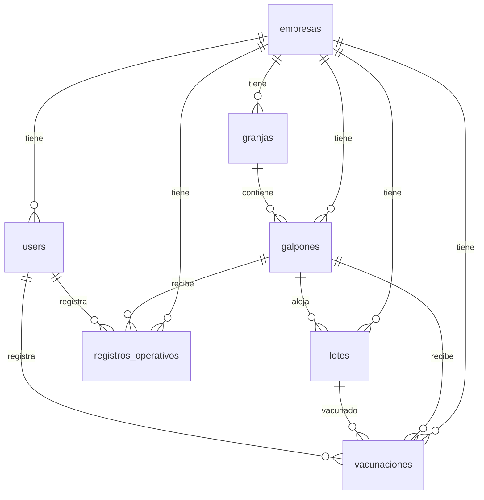

# Referencia — Estructura de base de datos

**Fuente maestra del esquema implementado.** Solo tablas con migración en el repo; no documentar DDL especulativo aquí.  
Al añadir una tabla: migración primero, luego esta sección y entrada en `portal/CHANGELOG.md`.  
Bloques y tablas futuras (sin migración): `plan-desarrollo.md`.  
Criterios del modelo: [`criterios-modelo.md`](criterios-modelo.md). Reglas de negocio: `avicore-negocio/references/reglas.md`.

**Motor:** PostgreSQL · **Convención:** `empresa_id` en tablas operativas salvo excepciones documentadas.

**Integridad referencial:** FKs de `granjas`, `galpones`, `lotes`, `registros_operativos` y `vacunaciones` usan `ON DELETE RESTRICT` (no cascade). Anulación lógica en app; no hard-delete de padres con historial o hijos.

---

## Diagrama de relaciones (implementado)

---

## Tablas

### `empresas`

| Campo | Tipo | Null | Notas |
|-------|------|------|-------|
| id | bigint PK | No | |
| nombre | string | No | |
| codigo | string | Sí | |
| logo_path | string | Sí | |
| estado | string | No | `activa`, `suspendida`, `inactiva` |
| configuracion | json | Sí | |
| created_at, updated_at | timestamp | No | |

### `users`

| Campo | Tipo | Null | Notas |
|-------|------|------|-------|
| id | bigint PK | No | |
| empresa_id | FK empresas | Sí | Null solo Admin AviCore |
| name | string | No | |
| documento | string | No | Único por `empresa_id` |
| email | string | Sí | |
| password | string | No | |
| rol | string | No | Ver `avicore-negocio/references/permisos.md` |
| activo | boolean | No | |
| must_change_password | boolean | No | |
| last_login_at | timestamp | Sí | |
| ultimo_galpon_id | FK galpones | Sí | Último galpón de trabajo (operario) |
| created_at, updated_at | timestamp | No | |

**Índices:** `(empresa_id, documento)` único; `users_documento_admin_unique` parcial en `documento` donde `empresa_id IS NULL` (Admin AviCore).

### `granjas`

| Campo | Tipo | Null | Notas |
|-------|------|------|-------|
| id | bigint PK | No | |
| empresa_id | FK | No | |
| nombre | string | No | |
| codigo | string | Sí | |
| ubicacion | string | Sí | |
| activa | boolean | No | |
| created_at, updated_at | timestamp | No | |

### `galpones`

| Campo | Tipo | Null | Notas |
|-------|------|------|-------|
| id | bigint PK | No | |
| empresa_id | FK | No | |
| granja_id | FK granjas | No | |
| nombre | string | No | |
| codigo | string | Sí | |
| capacidad | integer | Sí | |
| estado | string | No | `activo`, `inactivo`, `en_mantenimiento`, `vacio_sanitario` |
| activo | boolean | No | |
| aves_actuales | integer | No | Calculado/ajustado por reglas |
| observacion | text | Sí | |
| created_at, updated_at | timestamp | No | |

### `lotes`

| Campo | Tipo | Null | Notas |
|-------|------|------|-------|
| id | bigint PK | No | |
| empresa_id | FK | No | |
| galpon_id | FK galpones | No | |
| codigo | string | No | Código interno AviCore (auto o manual) |
| codigo_sma | string | Sí | Nº lote asignado por SMA (opcional al crear) |
| fecha_nacimiento | date | No | |
| fecha_ingreso | date | No | |
| cantidad_inicial | integer | No | |
| linea_raza | string | Sí | |
| tipo_huevo | string | No | `blanco`, `color` |
| estado | string | No | `activo`, `en_produccion`, `trasladado`, `cerrado` |
| observacion | text | Sí | |
| created_at, updated_at | timestamp | No | |

### `registros_operativos`

| Campo | Tipo | Null | Notas |
|-------|------|------|-------|
| id | bigint PK | No | |
| empresa_id | FK | No | |
| galpon_id | FK | No | |
| user_id | FK users | No | |
| tipo | string | No | `huevos`, `muertes`, `descarte`, `alimento`, `combinado` |
| huevos | integer | Sí | Aptos/comerciales (tipo `huevos` o parte de `combinado`) |
| huevos_descarte | integer | Sí | Rotos/sucios (tipo `huevos`; default 0) |
| muertes | integer | Sí | |
| descarte_aves | integer | Sí | Gallinas vivas dadas de baja (tipo `descarte`) |
| alimento_kg | decimal | Sí | |
| observacion | text | Sí | |
| estado | string | No | `activo`, `anulado` |
| anulado_at | timestamp | Sí | |
| anulado_por | FK users | Sí | |
| motivo_anulacion | text | Sí | |
| created_at, updated_at | timestamp | No | Fecha/hora de carga = created_at |

### `vacunaciones`

Registro operativo de vacunación por lote (tabla propia; no es fila en `registros_operativos`). Historial operario une ambas fuentes vía `OperarioGalponService::historialPaginado`.

| Campo | Tipo | Null | Notas |
|-------|------|------|-------|
| id | bigint PK | No | |
| empresa_id | FK | No | |
| galpon_id | FK galpones | No | Galpón de trabajo al registrar |
| lote_id | FK lotes | No | Lote vacunado |
| user_id | FK users | No | Operario que registra |
| vacuna | string | No | Enum `VacunaTipo` (`newcastle`, `bronquitis`, `gumboro`, `encefalomielitis`, `pox`) |
| observacion | text | Sí | |
| estado | string | No | `activo`, `anulado` — mismo criterio que registros operativos |
| anulado_at | timestamp | Sí | |
| anulado_por | FK users | Sí | |
| motivo_anulacion | text | Sí | |
| created_at, updated_at | timestamp | No | Fecha/hora de carga = created_at |

**Relación:** `Lote::vacunaciones()` · resumen en UI: `Vacunacion::cantidadResumen()` («Vacuna {tipo} · lote {código}»).

---

## Índices recomendados

| Tabla | Índice |
|-------|--------|
| Varias | `empresa_id` |
| registros_operativos | `galpon_id`, `created_at`, `tipo`, `(empresa_id, user_id, created_at)` historial operario |
| vacunaciones | `empresa_id`, `(lote_id, created_at)`, `(galpon_id, created_at)`, `(empresa_id, user_id, created_at)` historial operario |
| lotes | `estado`, `(empresa_id, codigo)` único |
| users | `(empresa_id, documento)` único |
| users | `documento` único parcial (`empresa_id IS NULL`, Admin AviCore) |

---

## Checklist al modificar esquema

- [ ] `esquema-bd.md` actualizado
- [ ] Migración / modelo alineados
- [ ] `avicore-negocio/references/reglas.md` si cambia regla
- [ ] `avicore-ui/references/pantallas-flujos.md` si cambia formulario
- [ ] `portal/CHANGELOG.md` con entrada breve
