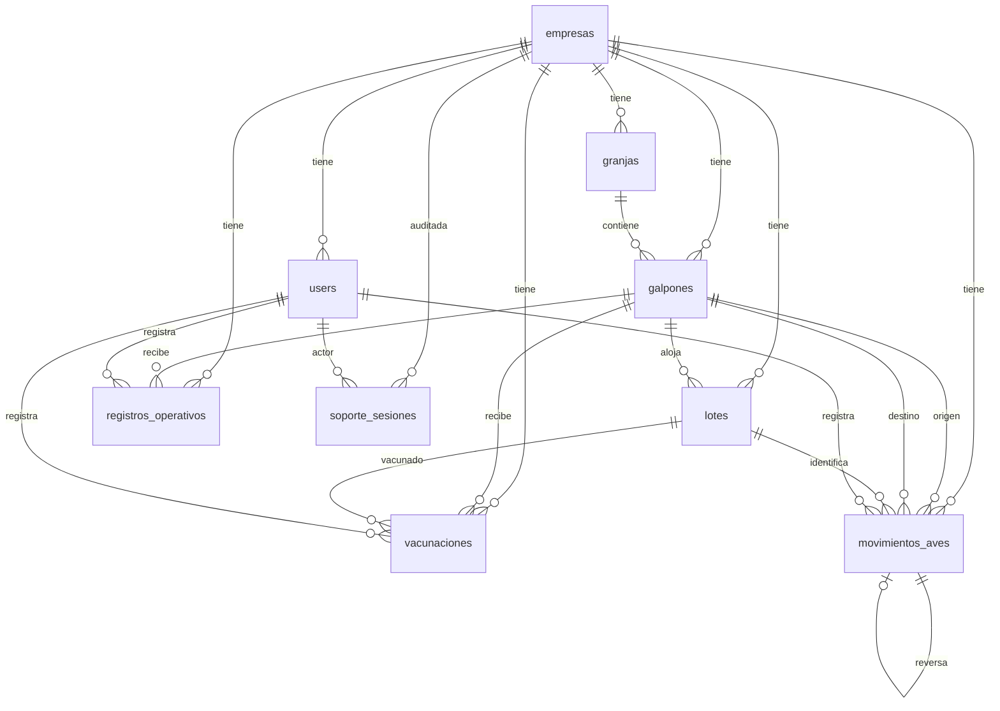

# Referencia — Estructura de base de datos

**Fuente maestra del esquema implementado.** Solo tablas con migración en el repo; no documentar DDL especulativo aquí.  
Al añadir una tabla: migración primero, luego esta sección y entrada en `portal/CHANGELOG.md`.  
Bloques y tablas futuras (sin migración): `plan-desarrollo.md`.  
Criterios del modelo: [`criterios-modelo.md`](criterios-modelo.md). Reglas de negocio: `avicore-negocio/references/reglas.md`.

**Motor:** PostgreSQL · **Convención:** `empresa_id` en tablas operativas salvo excepciones documentadas.

**Integridad referencial:** FKs de `granjas`, `galpones`, `lotes`, `registros_operativos` y `vacunaciones` usan `ON DELETE RESTRICT` (no cascade). Anulación lógica en app; no hard-delete de padres con historial o hijos.

---

## Diagrama de relaciones (implementado)

```mermaid
erDiagram
    empresas ||--o{ users : tiene
    empresas ||--o{ granjas : tiene
    empresas ||--o{ galpones : tiene
    empresas ||--o{ lotes : tiene
    empresas ||--o{ registros_operativos : tiene
    empresas ||--o{ vacunaciones : tiene
    empresas ||--o{ movimientos_aves : tiene
    empresas ||--o{ soporte_sesiones : auditada
    users ||--o{ soporte_sesiones : actor
    granjas ||--o{ galpones : contiene
    galpones ||--o{ lotes : aloja
    galpones ||--o{ registros_operativos : recibe
    galpones ||--o{ vacunaciones : recibe
    galpones ||--o{ movimientos_aves : origen
    galpones ||--o{ movimientos_aves : destino
    lotes ||--o{ vacunaciones : vacunado
    lotes ||--o{ movimientos_aves : identifica
    users ||--o{ registros_operativos : registra
    users ||--o{ vacunaciones : registra
    users ||--o{ movimientos_aves : registra
    movimientos_aves ||--o| movimientos_aves : reversa
```

---

## Tablas

### `empresas`

| Campo | Tipo | Null | Notas |
|-------|------|------|-------|
| id | bigint PK | No | |
| nombre | string | No | |
| codigo | string | Sí | |
| logo_path | string | Sí | |
| estado | string | No | `activa`, `suspendida`, `inactiva` |
| configuracion | json | Sí | `zona_horaria`, `unidades` (`huevos_por_maple`, `maples_por_cajon`), `estado_historial[]` (EMP-02/03) |
| created_at, updated_at | timestamp | No | |

### `users`

| Campo | Tipo | Null | Notas |
|-------|------|------|-------|
| id | bigint PK | No | |
| empresa_id | FK empresas | Sí | Null solo Admin AviCore |
| name | string | No | |
| documento | string | No | Único por `empresa_id` |
| email | string | Sí | |
| password | string | No | |
| rol | string | No | Ver `avicore-negocio/references/permisos.md` |
| activo | boolean | No | |
| must_change_password | boolean | No | |
| last_login_at | timestamp | Sí | |
| ultimo_galpon_id | FK galpones | Sí | Último galpón de trabajo (operario) |
| created_at, updated_at | timestamp | No | |

**Índices:** `(empresa_id, documento)` único; `users_documento_admin_unique` parcial en `documento` donde `empresa_id IS NULL` (Admin AviCore).

### `soporte_sesiones` (EMP-06)

| Campo | Tipo | Null | Notas |
|-------|------|------|-------|
| id | bigint PK | No | |
| empresa_id | FK empresas | No | Empresa cliente en soporte |
| actor_id | FK users | No | Admin AvicCore que ingresa |
| motivo | string | No | Texto libre (mín. configurable) |
| started_at | timestamp | No | Inicio de sesión |
| expires_at | timestamp | No | Caducidad automática |
| ended_at | timestamp | Sí | Null = sesión abierta |
| end_reason | string | Sí | `manual`, `logout`, `expired`, `replaced`, … |
| acciones | json | Sí | Bitácora de sesión: `inicio`, `consulta_resumen`, `fin` (EMP-07) |
| created_at, updated_at | timestamp | No | |

**Índices:** `(actor_id, ended_at)`; `(empresa_id, started_at)`.

### `granjas`

| Campo | Tipo | Null | Notas |
|-------|------|------|-------|
| id | bigint PK | No | |
| empresa_id | FK | No | |
| nombre | string | No | |
| codigo | string | Sí | Código interno; único por `empresa_id` si se informa (EST-01) |
| dicose | string | Sí | Nº DICOSE (texto numérico/guiones); único por `empresa_id` |
| ubicacion | string | Sí | |
| activa | boolean | No | |
| created_at, updated_at | timestamp | No | |

### `galpones`

| Campo | Tipo | Null | Notas |
|-------|------|------|-------|
| id | bigint PK | No | |
| empresa_id | FK | No | |
| granja_id | FK granjas | No | |
| nombre | string | No | |
| codigo | string | Sí | |
| capacidad | integer | Sí | |
| estado | string | No | `activo`, `inactivo`, `en_mantenimiento`, `vacio_sanitario` |
| activo | boolean | No | |
| aves_actuales | integer | No | Calculado/ajustado por reglas |
| observacion | text | Sí | |
| created_at, updated_at | timestamp | No | |

### `lotes`

| Campo | Tipo | Null | Notas |
|-------|------|------|-------|
| id | bigint PK | No | |
| empresa_id | FK | No | |
| galpon_id | FK galpones | No | |
| codigo | string | No | Código interno AviCore (auto o manual) |
| codigo_sma | string | Sí | Nº lote asignado por SMA (opcional al crear) |
| fecha_nacimiento | date | No | |
| fecha_ingreso | date | No | |
| cantidad_inicial | integer | No | |
| linea_raza | string | Sí | |
| tipo_huevo | string | No | `blanco`, `color` |
| estado | string | No | `activo`, `en_produccion`, `trasladado`, `cerrado` |
| observacion | text | Sí | |
| estado_historial | json | Sí | Transiciones de estado con motivo, actor y fecha (EST-06) |
| created_at, updated_at | timestamp | No | |

### `registros_operativos`

| Campo | Tipo | Null | Notas |
|-------|------|------|-------|
| id | bigint PK | No | |
| empresa_id | FK | No | |
| galpon_id | FK | No | |
| user_id | FK users | No | |
| tipo | string | No | `huevos`, `muertes`, `descarte`, `alimento`, `combinado` (legado AUD-09; sin altas nuevas) |
| idempotencia_clave | string(64) | Sí | UUID por intención de carga (`IdempotenciaCaptura`, CAP-07); única por `empresa_id` |
| cero_confirmado | boolean | No | Default `false`; `true` = operario confirmó explícitamente cero (CAP-10, huevos/muertes/descarte) |
| huevos | integer | Sí | Aptos/comerciales (tipo `huevos` o parte de `combinado`) |
| huevos_descarte | integer | Sí | Rotos/sucios (tipo `huevos`; default 0) |
| muertes | integer | Sí | |
| descarte_aves | integer | Sí | Gallinas vivas dadas de baja (tipo `descarte`) |
| alimento_kg | decimal | Sí | |
| observacion | text | Sí | |
| estado | string | No | `activo`, `anulado` |
| anulado_at | timestamp | Sí | |
| anulado_por | FK users | Sí | |
| motivo_anulacion | text | Sí | |
| created_at, updated_at | timestamp | No | Fecha/hora de carga = created_at |

### `vacunaciones`

Registro operativo de vacunación por lote (tabla propia; no es fila en `registros_operativos`). Historial operario une ambas fuentes vía `OperarioGalponService::historialPaginado`.

| Campo | Tipo | Null | Notas |
|-------|------|------|-------|
| id | bigint PK | No | |
| empresa_id | FK | No | |
| galpon_id | FK galpones | No | Galpón de trabajo al registrar |
| lote_id | FK lotes | No | Lote vacunado |
| user_id | FK users | No | Operario que registra |
| vacuna | string | No | Enum `VacunaTipo` (`newcastle`, `bronquitis`, `gumboro`, `encefalomielitis`, `pox`) |
| idempotencia_clave | string(64) | Sí | UUID por apertura del diálogo (`IdempotenciaCaptura`, CAP-07); única por empresa |
| observacion | text | Sí | Opcional, máx. 500 caracteres |
| estado | string | No | `activo`, `anulado` — mismo criterio que registros operativos |
| anulado_at | timestamp | Sí | |
| anulado_por | FK users | Sí | |
| motivo_anulacion | text | Sí | |
| created_at, updated_at | timestamp | No | Fecha/hora de carga = created_at |

**Relación:** `Lote::vacunaciones()` · resumen en UI: `Vacunacion::cantidadResumen()` («Vacuna {tipo} · lote {código}»).

### `correcciones_registro_operativo`

Trazabilidad D07 de correcciones sobre registros operativos activos (AUD-04). El registro original no se borra; se actualizan valores y se conserva antes/después.

| Campo | Tipo | Null | Notas |
|-------|------|------|-------|
| id | bigint PK | No | |
| empresa_id | FK | No | |
| registro_operativo_id | FK registros_operativos | No | Original vinculado |
| valores_anteriores | json | No | Snapshot de campos corregibles |
| valores_nuevos | json | No | Valores aplicados |
| motivo | text | No | Obligatorio |
| corregido_por | FK users | No | Actor supervisor |
| fecha_efectiva | timestamp | No | Momento efectivo (D07) |
| created_at, updated_at | timestamp | No | |

**Relación:** `RegistroOperativo::correcciones()` · acción `CorregirRegistroOperativoAction`.

### `movimientos_aves`

Ledger de movimientos de aves (MOV-01): entradas, traslados, ajustes, cierres y faena. Inmutable (`PreventsHardDelete`); reversión enlazada sin borrar historia.

| Campo | Tipo | Null | Notas |
|-------|------|------|-------|
| id | bigint PK | No | |
| empresa_id | FK | No | |
| tipo | string | No | `MovimientoAvesTipo`: entrada, traslado, ajuste, cierre_lote, faena, reversion |
| estado | string | No | `activo`, `reversado` — solo `activo` cuenta en saldo reconstruido |
| galpon_origen_id | FK galpones | Sí | Origen o galpón único (ajuste/salida) |
| galpon_destino_id | FK galpones | Sí | Destino (entrada/traslado) |
| lote_id | FK lotes | Sí | Identificación D01 cuando aplica; no reparto silencioso |
| cantidad | unsigned int | No | Siempre positiva salvo validación de ajuste vía `ajuste_delta` |
| ajuste_delta | int | Sí | Solo tipo `ajuste`; diferencia firmada conteo vs sistema |
| motivo | text | No | Obligatorio |
| registrado_por | FK users | No | Actor |
| fecha_efectiva | timestamp | No | Momento efectivo (D07) |
| reversa_de_id | FK movimientos_aves | Sí | Reversión → movimiento original |
| reversado_por_id | FK movimientos_aves | Sí | Original → fila de reversión |
| metadata | json | Sí | `origen` (`saldo_inicial_lote`/`entrada_externa`), imputaciones D01, referencias SMA |
| idempotencia_clave | string(64) | Sí | Única por `empresa_id`; saldo inicial usa `saldo-inicial-lote:{lote_id}` |
| created_at, updated_at | timestamp | No | |

**Saldo:** `MovimientoAvesEfecto::saldoNetoPorGalpon()` — reconstrucción por galpón; mortalidad operativa sigue en `registros_operativos`. Detalle: `movimientos-aves.md`.

### `auditorias`

Bitácora transversal de acciones críticas (AUD-05). Quién, qué, cuándo y por qué; metadata sanitizada (sin contraseñas ni tokens).

| Campo | Tipo | Null | Notas |
|-------|------|------|-------|
| id | bigint PK | No | |
| empresa_id | FK | Sí | Scope tenant; null solo si aplica acción de plataforma |
| actor_id | FK users | No | Usuario que ejecutó la acción |
| categoria | string | No | `AuditoriaCategoria`: usuario, empresa, soporte, lote, operacion, correccion, movimiento*, ajuste* |
| accion | string | No | p. ej. `creado`, `estado_cambiado`, `anulado`, `corregido`, `inicio`, `fin` |
| entidad_tipo | string | Sí | Clase o recurso auditado |
| entidad_id | bigint | Sí | ID del recurso |
| motivo | text | Sí | Obligatorio cuando la acción de negocio lo exige |
| metadata | json | Sí | Antes/después y contexto; sanitizado por `AuditoriaMetadataSanitizer` |
| occurred_at | timestamp | No | Momento efectivo del evento |
| created_at, updated_at | timestamp | No | |

\* `movimiento` y `ajuste` reservados para bloque MOV.

**Registro:** `RegistrarAuditoriaAction` desde Actions críticas (usuarios, empresas, soporte, lotes, anulaciones, correcciones). Soporte mantiene además `soporte_sesiones.acciones`.

### `documentos_emitidos`

Copias inmutables de reportes PDF/Excel al emitir (AUD-08 / REP-11). Sin borrado desde la app.

| Campo | Tipo | Null | Notas |
|-------|------|------|-------|
| id | bigint PK | No | |
| empresa_id | FK | No | |
| emitido_por | FK users | No | Actor que generó el archivo |
| tipo | string | No | p. ej. `reporte_diario` |
| formato | string | No | `DocumentoEmitidoFormato`: pdf, xlsx |
| nombre_archivo | string | No | Nombre de descarga |
| storage_disk | string | No | Disco privado (default `local`) |
| storage_path | string | No | Ruta relativa única por disco |
| checksum_sha256 | char(64) | No | Integridad del contenido |
| filtros | json | Sí | Snapshot de filtros al emitir |
| metadata | json | Sí | Versión, totales, etc. |
| emitido_at | timestamp | No | Momento de emisión |
| fecha_corte | timestamp | Sí | Corte de datos del reporte |
| created_at, updated_at | timestamp | No | |

**Registro:** `RegistrarDocumentoEmitidoAction` (bloque REP). Retención: `retencion-d07.md`.

---

## Índices recomendados

| Tabla | Índice |
|-------|--------|
| Varias | `empresa_id` |
| registros_operativos | `galpon_id`, `created_at`, `tipo`, `(empresa_id, user_id, created_at)` historial operario; `(empresa_id, idempotencia_clave)` único |
| vacunaciones | `empresa_id`, `(lote_id, created_at)`, `(galpon_id, created_at)`, `(empresa_id, user_id, created_at)` historial operario; `(empresa_id, idempotencia_clave)` único |
| correcciones_registro_operativo | `(empresa_id, registro_operativo_id)` |
| movimientos_aves | `(empresa_id, fecha_efectiva)`, `(galpon_origen_id, fecha_efectiva)`, `(galpon_destino_id, fecha_efectiva)`, `(lote_id, fecha_efectiva)`, `estado`, `tipo`, único `(empresa_id, idempotencia_clave)` |
| auditorias | `(empresa_id, occurred_at)`, `(categoria, occurred_at)`, `(entidad_tipo, entidad_id)`, `actor_id` |
| documentos_emitidos | `(empresa_id, emitido_at)`, `(empresa_id, tipo, emitido_at)`, único `(storage_disk, storage_path)` |
| granjas | `(empresa_id, dicose)` único; `(empresa_id, codigo)` único |
| galpones | `(granja_id, codigo)` único |
| lotes | `estado`, `(empresa_id, codigo)` único |
| users | `(empresa_id, documento)` único |
| users | `documento` único parcial (`empresa_id IS NULL`, Admin AviCore) |

---

## Checklist al modificar esquema

- [ ] `esquema-bd.md` actualizado
- [ ] Migración / modelo alineados
- [ ] `avicore-negocio/references/reglas.md` si cambia regla
- [ ] `avicore-ui/references/pantallas-flujos.md` si cambia formulario
- [ ] `portal/CHANGELOG.md` con entrada breve
