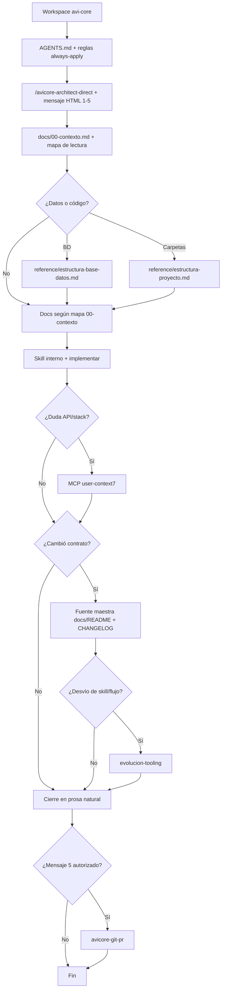

# Configuración de Cursor para AviCore

[Rules](https://cursor.com/docs/rules) · [Skills](https://cursor.com/docs/skills)

## Flujo del agente (oficial)

**Usuario:** solo `/avicore-architect-direct` + plantillas HTML. **Skills:** internos (13); el arquitecto los elige (`disable-model-invocation: true`). **Pasos detallados del flujo:** solo en [`.cursor/commands/avicore-architect-direct.md`](../../.cursor/commands/avicore-architect-direct.md).

## Punto de entrada

| Prioridad | Archivo |
|-----------|---------|
| 1 | [`docs/00-contexto.md`](../00-contexto.md) — contrato y producto |
| 2 | [`.cursor/commands/avicore-architect-direct.md`](../../.cursor/commands/avicore-architect-direct.md) — flujo slash |
| 3 | [`AGENTS.md`](../../AGENTS.md) — puntero rápido |
| 4 | [`docs/reference/`](../reference/) si aplica |

## Inventario

| Capa | Cantidad |
|------|----------|
| Docs producto `01`–`12` | 12 |
| Contexto + referencias + README + CHANGELOG | 5 |
| Cursor docs `00`–`06` + `01-indice` | 8 |
| Skills internos | 13 |
| Mensajes usuario (HTML) | 5 |
| Reglas `.mdc` | 7 |
| Comando slash | 1 |

## Reglas `.cursor/rules/`

| Regla | Cuándo |
|-------|--------|
| `avicore-agente-permanente.mdc` | Siempre — puntero al contrato |
| `avicore-modo-respuesta-clara.mdc` | Siempre — chat en prosa natural |
| `avicore-modo-caverman.mdc` | Opcional (`alwaysApply: false`) — no usar junto con Clara |
| `avicore-laravel-livewire.mdc` | `*.php`, `*.blade.php` |
| `avicore-ui-tailwind.mdc` | `resources/views`, css, js |
| `avicore-estandares-codigo.mdc` | `app/`, `resources/`, etc. |
| `avicore-docs-referencia.mdc` | `docs/reference/**` |

La regla always-apply **no sustituye** `00-contexto.md`.

## Skills (13 internos)

Catálogo (única tabla mensaje → skill): [`03-skills-avicore.md`](03-skills-avicore.md) · Plantillas: [`02-avicore-mensajes-reutilizables.html`](02-avicore-mensajes-reutilizables.html) · Matriz de mantenimiento: [`05-evolucion-skills-y-docs.md`](05-evolucion-skills-y-docs.md)

**Anti-drift:** `npm run check:agent-docs` o `node scripts/check-agent-docs-sync.cjs` (tras cambiar comando, `03-skills`, `AGENTS.md` o inventario en este archivo).

## Uso diario

1. `/avicore-architect-direct` + mensaje del HTML.
2. Leer docs del mapa en `00-contexto` (no todo el repo).
3. Esquema nuevo → `reference/estructura-base-datos.md` + CHANGELOG.
4. Publicar → mensaje **5** (autorización explícita).

## MCP y Git / PR

| Prioridad | Uso | Herramienta |
|-----------|-----|-------------|
| 1 | Negocio AviCore | `docs/` |
| 2 | API/sintaxis stack | Context7 `user-context7` |
| 3 | Crear PR (mensaje **5**) | MCP `user-github` → `gh pr create` → fallback token Git (ver skill `avicore-git-pr`) |

**Auth GitHub:** `gh auth status` debe coincidir con el dueño del remoto (`MarioB235/avi-core`, etc.). Si `gh` usa otra cuenta, el push puede funcionar igual pero la PR no — el skill `avicore-git-pr` documenta el fallback. Alinear con `gh auth login` evita fricción.

## Modo respuesta en chat

| Modo | Recomendación | Regla |
|------|---------------|-------|
| **Clara** (default) | Prosa natural, entendible | `avicore-modo-respuesta-clara.mdc` · [`06`](06-modo-respuesta-clara.md) |
| **Caverman** (opcional) | Solo uno: Clara **o** Caverman | [`04-modo-respuesta-caverman.md`](04-modo-respuesta-caverman.md) |

## Evolución del tooling

Solo ante desvío real del flujo documentado: [`05-evolucion-skills-y-docs.md`](05-evolucion-skills-y-docs.md) · skill `avicore-evolucion-tooling`.
