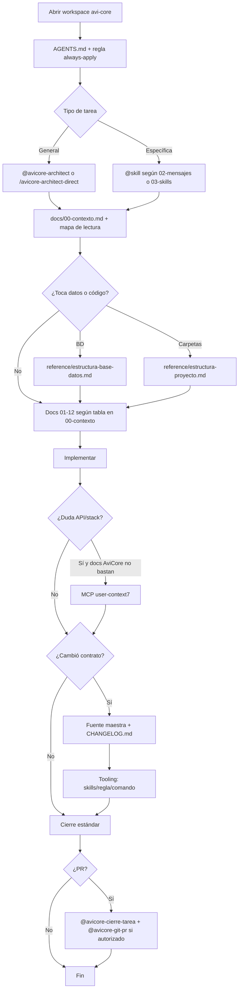

# Configuración de Cursor para AviCore

[Rules](https://cursor.com/docs/rules) · [Skills](https://cursor.com/docs/skills)

## Flujo del agente (oficial)

## Punto de entrada

| Prioridad | Archivo |
|-----------|---------|
| 1 | [`docs/00-contexto.md`](../00-contexto.md) |
| 2 | [`AGENTS.md`](../../AGENTS.md) |
| 3 | [`docs/reference/`](../reference/) si aplica |

## Inventario verificado

| Capa | Cantidad | Estado |
|------|----------|--------|
| Docs producto `01`–`12` | 12 | Correcto |
| Contexto + referencias + README + CHANGELOG | 5 | Correcto |
| Cursor docs `00`–`05` + `01-indice-agente` | 6 | Correcto |
| Skills | 12 internos · 5 mensajes usuario · evolución automática | Alineado |
| Reglas `.mdc` | 6 | Correcto |
| Comando slash | 1 | Correcto |

## Reglas `.cursor/rules/`

| Regla | Cuándo |
|-------|--------|
| `avicore-agente-permanente.mdc` | Siempre (contrato resumido) |
| `avicore-laravel-livewire.mdc` | Archivos `*.php`, `*.blade.php` |
| `avicore-ui-tailwind.mdc` | `resources/views`, css, js |
| `avicore-docs-referencia.mdc` | Editar `docs/reference/**` |

La regla always-apply **no sustituye** `00-contexto.md`; repite lo mínimo para cada chat sin cargar el archivo completo.

## Skills (12 internos)

Catálogo: [`03-skills-avicore.md`](03-skills-avicore.md) · Plantillas HTML: [`02-avicore-mensajes-reutilizables.html`](02-avicore-mensajes-reutilizables.html)

## Uso diario

1. Elegir skill o `/avicore-architect-direct` (plantillas en el HTML de mensajes).
2. Leer solo docs del mapa (`00-contexto`).
3. Cambio de esquema → `reference/estructura-base-datos.md` + `CHANGELOG.md`.
4. Commitear `.cursor/`, `docs/`, `AGENTS.md`.

## MCP (orden de uso)

| Prioridad | Uso | MCP |
|-----------|-----|-----|
| 1 | Negocio, pantallas, permisos AviCore | `docs/` del proyecto |
| 2 | API, versión o sintaxis de librería del stack | Context7 `user-context7`: `resolve-library-id` → `query-docs` (máx. 3/pregunta) |
| 3 | Commit / PR | GitHub `user-github` (mensaje **5** + autorización) |

El paso 2 del comando `/avicore-architect-direct` obliga Context7 **solo cuando** las docs AviCore no resuelven la duda técnica. Git local: terminal.

## Estándares de código

`docs/reference/estandares-codigo.md` — regla `avicore-estandares-codigo.mdc` al editar `app/`, `resources/`, etc.

## Modo respuesta en chat

| Modo | Uso | Regla |
|------|-----|-------|
| **Clara** (default) | Conciso + lenguaje llano; no técnico / estudiante | `avicore-modo-respuesta-clara.mdc` · [`06-modo-respuesta-clara.md`](06-modo-respuesta-clara.md) |
| **Caverman** (opcional) | Prosa aún más corta; no sacrificar claridad si ambos activos | [`04-modo-respuesta-caverman.md`](04-modo-respuesta-caverman.md) |

Global: **Settings → Features → Rules for AI** (afecta todos los proyectos).

## Evolución automática (skills y docs)

El arquitecto, al cerrar tareas, aplica `avicore-evolucion-tooling`: actualiza skills desactualizados, crea skills solo para workflows recurrentes nuevos, mantiene `03-skills`, `CHANGELOG` y docs maestras. Ver [`05-evolucion-skills-y-docs.md`](05-evolucion-skills-y-docs.md).
