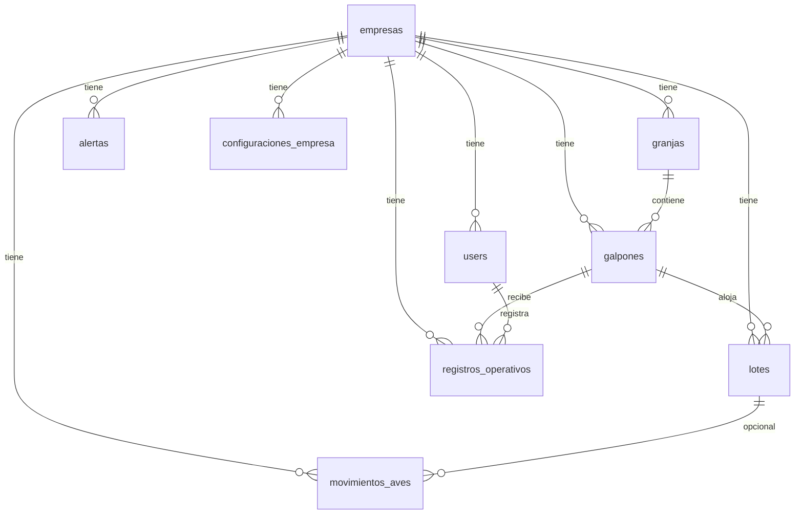

# Referencia — Estructura de base de datos

**Fuente maestra del esquema.** Mantener sincronizado con migraciones reales.  
Al cambiar tablas o campos: editar este archivo y registrar en `docs/CHANGELOG.md`.  
Criterios y reglas del modelo: `docs/04-modelo-de-datos.md`. Reglas de negocio: `docs/05-reglas-de-negocio.md`.

**Motor:** PostgreSQL · **Convención:** `empresa_id` en tablas operativas salvo excepciones documentadas.

---

## Diagrama de relaciones (MVP)

---

## Tablas

### `empresas`

| Campo | Tipo | Null | Notas |
|-------|------|------|-------|
| id | bigint PK | No | |
| nombre | string | No | |
| codigo | string | Sí | |
| logo_path | string | Sí | |
| estado | string | No | `activa`, `suspendida`, `inactiva` |
| configuracion | json | Sí | |
| created_at, updated_at | timestamp | No | |

### `users`

| Campo | Tipo | Null | Notas |
|-------|------|------|-------|
| id | bigint PK | No | |
| empresa_id | FK empresas | Sí | Null solo Admin AviCore |
| name | string | No | |
| documento | string | No | Único por `empresa_id` |
| email | string | Sí | |
| password | string | No | |
| rol | string | No | Ver `docs/06-roles-y-permisos.md` |
| activo | boolean | No | |
| must_change_password | boolean | No | |
| last_login_at | timestamp | Sí | |
| created_at, updated_at | timestamp | No | |

**Índices:** `(empresa_id, documento)` único; `users_documento_admin_unique` parcial en `documento` donde `empresa_id IS NULL` (Admin AviCore).

### `granjas`

| Campo | Tipo | Null | Notas |
|-------|------|------|-------|
| id | bigint PK | No | |
| empresa_id | FK | No | |
| nombre | string | No | |
| codigo | string | Sí | |
| ubicacion | string | Sí | |
| activa | boolean | No | |
| created_at, updated_at | timestamp | No | |

### `galpones`

| Campo | Tipo | Null | Notas |
|-------|------|------|-------|
| id | bigint PK | No | |
| empresa_id | FK | No | |
| granja_id | FK granjas | No | |
| nombre | string | No | |
| codigo | string | Sí | |
| capacidad | integer | Sí | |
| estado | string | No | `activo`, `inactivo`, `en_mantenimiento`, `vacio_sanitario` |
| activo | boolean | No | |
| aves_actuales | integer | No | Calculado/ajustado por reglas |
| observacion | text | Sí | |
| created_at, updated_at | timestamp | No | |

### `lotes`

| Campo | Tipo | Null | Notas |
|-------|------|------|-------|
| id | bigint PK | No | |
| empresa_id | FK | No | |
| galpon_id | FK galpones | No | |
| codigo | string | No | |
| fecha_nacimiento | date | No | |
| fecha_ingreso | date | No | |
| cantidad_inicial | integer | No | |
| linea_raza | string | Sí | |
| tipo_huevo | string | No | `blanco`, `color` |
| estado | string | No | `activo`, `en_produccion`, `trasladado`, `cerrado` |
| observacion | text | Sí | |
| created_at, updated_at | timestamp | No | |

### `registros_operativos`

| Campo | Tipo | Null | Notas |
|-------|------|------|-------|
| id | bigint PK | No | |
| empresa_id | FK | No | |
| galpon_id | FK | No | |
| user_id | FK users | No | |
| tipo | string | No | `huevos`, `muertes`, `alimento`, `combinado` |
| huevos | integer | Sí | |
| muertes | integer | Sí | |
| alimento_kg | decimal | Sí | |
| observacion | text | Sí | |
| estado | string | No | `activo`, `anulado` |
| anulado_at | timestamp | Sí | |
| anulado_por | FK users | Sí | |
| motivo_anulacion | text | Sí | |
| created_at, updated_at | timestamp | No | Fecha/hora de carga = created_at |

### `movimientos_aves`

| Campo | Tipo | Null | Notas |
|-------|------|------|-------|
| id | bigint PK | No | |
| empresa_id | FK | No | |
| galpon_id | FK | No | |
| lote_id | FK lotes | Sí | |
| tipo | string | No | `salida_parcial`, `traslado`, `ajuste`, `cierre` |
| cantidad | integer | No | |
| motivo | string | No | |
| destino | string | Sí | |
| user_id | FK users | No | |
| observacion | text | Sí | |
| created_at, updated_at | timestamp | No | |

### `auditorias`

| Campo | Tipo | Null | Notas |
|-------|------|------|-------|
| id | bigint PK | No | |
| empresa_id | FK | Sí | |
| user_id | FK users | No | |
| accion | string | No | |
| tabla | string | No | |
| registro_id | bigint | Sí | |
| valor_anterior | json | Sí | |
| valor_nuevo | json | Sí | |
| motivo | text | Sí | |
| created_at | timestamp | No | |

### `alertas`

| Campo | Tipo | Null | Notas |
|-------|------|------|-------|
| id | bigint PK | No | |
| empresa_id | FK | No | |
| galpon_id | FK | Sí | |
| tipo | string | No | |
| mensaje | text | No | |
| nivel | string | No | |
| revisada | boolean | No | |
| revisada_por | FK users | Sí | |
| revisada_at | timestamp | Sí | |
| created_at | timestamp | No | |

### `configuraciones_empresa`

| Campo | Tipo | Null | Notas |
|-------|------|------|-------|
| id | bigint PK | No | |
| empresa_id | FK | No | |
| clave | string | No | |
| valor | json | No | |
| created_at, updated_at | timestamp | No | |

**Claves ejemplo:** `cajon_maples`, `maple_huevos`, `logo_reportes`, `modulos_activos`.

---

## Índices recomendados

| Tabla | Índice |
|-------|--------|
| Varias | `empresa_id` |
| registros_operativos | `galpon_id`, `created_at`, `tipo` |
| lotes | `estado` |
| users | `(empresa_id, documento)` único |
| users | `documento` único parcial (`empresa_id IS NULL`, Admin AviCore) |

---

## Checklist al modificar esquema

- [ ] `reference/estructura-base-datos.md` actualizado
- [ ] Migración / modelo alineados
- [ ] `05-reglas-de-negocio.md` si cambia regla
- [ ] `02-pantallas-y-flujos.md` si cambia formulario
- [ ] `CHANGELOG.md` con entrada breve
